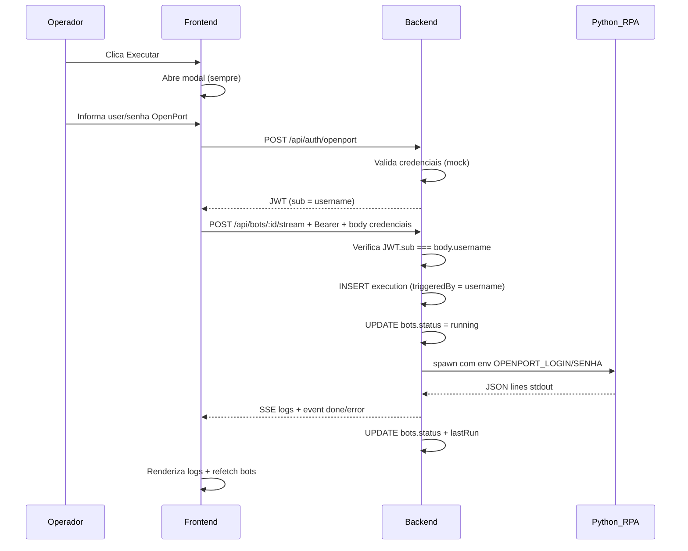
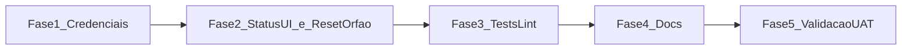

# Plano de Implementação UAT — Torre RPA

## Objetivo

Entregar um MVP **testável por operadores em ambiente local**, com fluxo confiável:

**Clicar Executar → informar credenciais OpenPort → validar → executar RPA → ver logs → registrar quem executou.**

**Fora de escopo deste plano:** Docker, PostgreSQL, página `/historico`, deploy em staging/produção.

---

## Diagnóstico (estado atual)

| Problema | Impacto no UAT | Arquivo(s) |
|---|---|---|
| Modal é pulado se `isAuthenticated === true` | Operador não é identificado a cada execução | [`apps/frontend/src/features/dashboard/dashboard.tsx`](apps/frontend/src/features/dashboard/dashboard.tsx) |
| Credenciais do modal não chegam ao RPA Playwright | RPA usa `.env` fixo; modal é enganoso | [`scripts/paralisacao/run.py`](scripts/paralisacao/run.py), [`apps/backend/src/services/executor.ts`](apps/backend/src/services/executor.ts) |
| `bots.status` / `lastRun` nunca atualizam | UI sempre mostra "Executar" / `idle` | [`apps/backend/src/services/executor.ts`](apps/backend/src/services/executor.ts) |
| Frontend não refaz polling durante execução | Status desatualizado na lista | [`apps/frontend/src/hooks/use-bots.ts`](apps/frontend/src/hooks/use-bots.ts) |
| Lint CI falha (13 erros Biome) | Pipeline quebrada | vários arquivos TS/CSS |
| `scripts/paralisacao/.env` ausente no ambiente | RPA falha sem credenciais (até correção do fluxo) | setup local |
| Bot pode ficar preso em `status = 'running'` se o backend cair durante execução | UI trava mostrando "em execução" indefinidamente | [`apps/backend/src/services/executor.ts`](apps/backend/src/services/executor.ts), boot do servidor |

---

## Arquitetura alvo (fluxo UAT)



**Regras de segurança (obrigatórias):**
- Senha **nunca** vai para `localStorage`, JWT ou banco de dados.
- Senha existe apenas em memória do React durante o fluxo de execução.
- `triggeredBy` persiste apenas o **username** (campo já existente em `executions`).

### ⚠️ Importante: duplo papel das credenciais do modal

As credenciais digitadas no modal são usadas em **dois lugares diferentes, com propósitos diferentes**:

1. **Autenticação no backend (`POST /api/auth/openport`)** — usa o **mock** (`OPENPORT_MOCK=true`, ver decisão na seção 4.3). Qualquer usuário/senha não-vazio é aceito para gerar o JWT e identificar o operador.
2. **Login real no OpenPort via Playwright (`OPENPORT_LOGIN` / `OPENPORT_SENHA`)** — usa as **mesmas credenciais**, mas agora validadas de verdade pelo site do OpenPort dentro do RPA.

**Consequência prática para quem for testar:** é possível passar pela etapa 1 (mock aceita) e falhar na etapa 2 (login real do OpenPort rejeita), já que a validação real só acontece dentro do Playwright. Isso é esperado e não é bug — mas deve ser comunicado aos operadores no roteiro de UAT para evitar confusão do tipo "o sistema disse que autenticou, mas depois deu erro de login".

---

## Fase 1 — Credenciais por execução (bloqueador)

### 1.1 Frontend: modal sempre, credenciais efêmeras

**Arquivo:** [`apps/frontend/src/features/dashboard/dashboard.tsx`](apps/frontend/src/features/dashboard/dashboard.tsx)

- Remover bypass `if (!isAuthenticated)`.
- `handleExecute(bot)` deve **sempre** chamar `openModal(bot)`.
- Remover dependência de `useAuthStore().isAuthenticated` para decidir execução.

**Arquivo:** [`apps/frontend/src/components/auth/auth-modal.tsx`](apps/frontend/src/components/auth/auth-modal.tsx)

- Alterar prop `onSuccess` para receber credenciais + token:
  ```typescript
  onSuccess: (credentials: AuthCredentials, token: string) => void
  ```
- Após `authenticate()`, chamar `onSuccess({ username, password }, res.token)`.
- Limpar campos de senha após submit (`setPassword('')`).

**Arquivo:** [`apps/frontend/src/stores/auth-store.ts`](apps/frontend/src/stores/auth-store.ts)

- Remover persistência em `localStorage` (token efêmero por execução).
- Manter store **in-memory** apenas se necessário para o token durante o stream; preferível passar token diretamente para `startStream` sem persistir.

**Arquivo:** [`apps/frontend/src/hooks/use-execution.ts`](apps/frontend/src/hooks/use-execution.ts)

- Alterar assinatura:
  ```typescript
  startStream(botId: string, botName: string, credentials: AuthCredentials, token: string)
  ```
- Trocar `GET` por `POST` em `/api/bots/${botId}/stream`.
- Headers: `Authorization: Bearer ${token}`, `Content-Type: application/json`.
- Body: `{ username, password }` (mesmos valores do modal).
- Manter parser SSE existente (eventos `data`, `done`, `error`).
- Tratar explicitamente o evento de erro "já está em execução" (ver critério de aceite 1.3) exibindo mensagem amigável no modal/toast, não só no console.

**Arquivo:** [`apps/frontend/src/lib/auth-token.ts`](apps/frontend/src/lib/auth-token.ts)

- Se existir leitura de localStorage, remover ou deprecar — token passa por parâmetro.

### 1.2 Backend: stream via POST com credenciais

**Arquivo:** [`apps/backend/src/routes/execution.routes.ts`](apps/backend/src/routes/execution.routes.ts)

- Trocar rota de `GET /:id/stream` para `POST /:id/stream`.
- Adicionar schema Zod:
  ```typescript
  const streamBodySchema = z.object({
    username: z.string().min(1),
    password: z.string().min(1),
  });
  ```
- Validar que `body.username === request.user.sub` (JWT). Retornar `403` se divergir.
- Se o bot já estiver com `status = 'running'`, retornar erro claro via SSE (`event: error`, mensagem "Bot já está em execução") para que o frontend exiba algo amigável (ver 1.1).
- Passar credenciais para `executeBot`:
  ```typescript
  executeBot(bot, sendEvent, {
    session,
    triggeredBy: body.username,
    openportLogin: body.username,
    openportSenha: body.password,
  })
  ```
- Manter `authMiddleware`, SSE, `req.raw.on('close')` e kill do processo.

**Arquivo:** [`apps/backend/src/services/executor.ts`](apps/backend/src/services/executor.ts)

- Refatorar assinatura de `executeBot` para objeto de opções (evitar 5+ parâmetros posicionais).
- No `spawn`, injetar credenciais via `env` (sobrescreve `.env` do RPA):
  ```typescript
  spawn(python, args, {
    env: {
      ...process.env,
      OPENPORT_LOGIN: options.openportLogin ?? '',
      OPENPORT_SENHA: options.openportSenha ?? '',
    },
  });
  ```
- **Não logar** credenciais em nenhum lugar (nem em `env` completo, nem em stack traces de erro).

**Arquivo:** [`scripts/paralisacao/run.py`](scripts/paralisacao/run.py)

- Atualizar comentário: credenciais vêm do spawn (`OPENPORT_LOGIN` / `OPENPORT_SENHA`), `.env` serve apenas para config operacional (planilha, timeouts, headless).
- Nenhuma lógica extra necessária — [`scripts/paralisacao/src/paralisacao/config.py`](scripts/paralisacao/src/paralisacao/config.py) já lê `os.getenv("OPENPORT_LOGIN")`.

**Arquivo:** [`scripts/__template__/run.py`](scripts/__template__/run.py)

- Documentar contrato: backend pode injetar `OPENPORT_LOGIN` / `OPENPORT_SENHA` via env.

### 1.3 Critério de aceite — Fase 1

- Cada clique em Executar abre o modal, mesmo após execuções anteriores.
- `executions.triggered_by` registra o username informado.
- RPA autentica no OpenPort com credenciais do modal (não depende de `scripts/paralisacao/.env` para login/senha).
- Senha não aparece em `localStorage`, logs ou respostas HTTP.
- Tentar executar um bot já em execução retorna mensagem amigável na UI (não só erro cru no console).

---

## Fase 2 — Status do bot e feedback na UI

### 2.1 Backend: sincronizar tabela `bots`

**Arquivo:** [`apps/backend/src/services/executor.ts`](apps/backend/src/services/executor.ts)

Importar `bots` de [`apps/backend/src/db/schema.ts`](apps/backend/src/db/schema.ts).

| Momento | Ação DB |
|---|---|
| Início da execução | `UPDATE bots SET status = 'running' WHERE id = bot.id` |
| Sucesso (`code === 0`) | `UPDATE bots SET status = 'done', last_run = finishedAt` |
| Erro / timeout / kill | `UPDATE bots SET status = 'error', last_run = finishedAt` |

- Envolver updates em `try/catch` (mesmo padrão dos logs — falha de DB não derruba execução).
- Em `finishOnce`, incluir update de `bots` junto com update de `executions`.

### 2.2 Reset de status órfão no boot do servidor

**Novo — resolve risco de bot preso em `running` após crash do backend.**

**Arquivo:** [`apps/backend/src/index.ts`](apps/backend/src/index.ts) (ou arquivo de bootstrap equivalente)

- Ao iniciar o servidor, antes de aceitar requisições, executar:
  ```sql
  UPDATE bots SET status = 'idle' WHERE status = 'running';
  ```
- Justificativa: se o processo Node cair (crash, `kill -9`, reinício manual) enquanto um bot está `running`, não existe mais nenhum processo Python vivo associado — o status ficaria travado indefinidamente sem essa limpeza.
- Logar no console quantos bots foram resetados, para visibilidade durante o UAT (ex.: `console.log('Reset 1 bot(s) de running para idle no boot')`).
- **Não** marcar como `error` — usar `idle`, pois não sabemos se a execução teria sucedido; é neutro e permite nova tentativa imediata.

### 2.3 Frontend: polling durante execução

**Arquivo:** [`apps/frontend/src/hooks/use-bots.ts`](apps/frontend/src/hooks/use-bots.ts)

```typescript
return useQuery({
  queryKey: ['bots'],
  queryFn: fetchBots,
  refetchInterval: (query) =>
    query.state.data?.some((b) => b.status === 'running') ? 2000 : false,
});
```

**Arquivo:** [`apps/frontend/src/hooks/use-execution.ts`](apps/frontend/src/hooks/use-execution.ts)

- Importar `useQueryClient`.
- Ao iniciar stream: `queryClient.invalidateQueries({ queryKey: ['bots'] })`.
- Ao receber `event: done` ou `event: error`: invalidar novamente.

**Arquivo:** [`apps/frontend/src/components/dashboard/bot-row.tsx`](apps/frontend/src/components/dashboard/bot-row.tsx)

- Comportamento atual (`disabled={isRunning}`) passará a funcionar após Fase 2 — validar visualmente.

### 2.4 Critério de aceite — Fase 2

- Botão muda para "Em execução…" enquanto RPA roda.
- Badge reflete `running` → `done` ou `error`.
- Coluna "Última execução" atualiza após conclusão.
- Reiniciar o backend manualmente com um bot em `running` (simulando crash) resulta em `status = 'idle'` após o próximo boot, e o botão "Executar" volta a ficar disponível na UI.

---

## Fase 3 — Testes e qualidade

### 3.1 Atualizar testes E2E do backend

**Arquivo:** [`apps/backend/__tests__/e2e.test.ts`](apps/backend/__tests__/e2e.test.ts)

| Teste existente | Alteração |
|---|---|
| `GET .../stream` | Trocar para `POST` com body `{ username, password }` |
| `401 sem token` | Manter, usando POST |
| `fluxo completo` | auth → POST stream com credenciais |

Adicionar testes:
- `403` quando `body.username !== JWT.sub`
- `400` quando body sem credenciais
- Verificar `executions.triggered_by` preenchido após stream (consulta SQLite no teste)
- Simular bot com `status = 'running'` no banco e verificar que reset no boot volta para `idle`

### 3.2 Corrigir lint Biome

Executar na raiz:
```bash
npm run lint
```

Corrigir manualmente se necessário:
- [`apps/frontend/src/components/log/log-drawer.tsx`](apps/frontend/src/components/log/log-drawer.tsx) — regra `useExhaustiveDependencies`
- Arquivos com formatação pendente listados pelo Biome

### 3.3 Critério de aceite — Fase 3

```bash
npm run lint:check    # 0 erros
npm run typecheck     # 0 erros
npm run test -w apps/backend   # todos passando
```

---

## Fase 4 — Documentação e setup UAT

### 4.1 Arquivos a atualizar

| Arquivo | O que documentar |
|---|---|
| [`README.md`](README.md) | Fluxo "credenciais a cada execução"; POST stream; setup UAT; reset de status no boot |
| [`docs/memory.md`](docs/memory.md) | Decisão de auth por execução; POST stream; status sync; decisão `OPENPORT_MOCK=true` |
| [`docs/onboarding-ia.md`](docs/onboarding-ia.md) | Contrato API atualizado; fluxo para agentes IA |
| [`.env.example`](.env.example) | `OPENPORT_MOCK=true` documentado como padrão para UAT interno (ver 4.3) |
| [`scripts/paralisacao/.env.example`](scripts/paralisacao/.env.example) | Separar: credenciais (opcional/fallback) vs config operacional (planilha, headless) |

### 4.2 Checklist de setup UAT (incluir no README)

1. `npm install` na raiz
2. `cp .env.example .env` — definir `JWT_SECRET` e confirmar `OPENPORT_MOCK=true`
3. `scripts\.venv\Scripts\pip install -r scripts\requirements.txt`
4. `playwright install chromium`
5. Copiar `scripts/paralisacao/.env.example` → `.env` (apenas config operacional: `PLANILHA`, `HEADLESS`, etc.)
6. Colocar planilha em `scripts/paralisacao/data/`
7. `npm run dev:backend` + `npm run dev:frontend`
8. Executar roteiro de validação (Fase 5)

### 4.3 Mock vs OpenPort real — decisão fechada

**Decisão:** para o UAT interno, o backend usará **`OPENPORT_MOCK=true`** como configuração padrão (não a alternativa de comentar `OPENPORT_API_URL`). Essa é a única forma suportada neste plano; não deixar as duas opções em aberto.

**Arquivo:** [`apps/backend/src/services/openport.ts`](apps/backend/src/services/openport.ts)

- Ler `OPENPORT_MOCK` explicitamente (não inferir pela ausência de `OPENPORT_API_URL`, que é frágil e ambíguo).
- Se `OPENPORT_MOCK=true`: aceitar qualquer par usuário/senha não-vazio e gerar JWT normalmente.
- Se `OPENPORT_MOCK=false` (fora de escopo deste UAT, reservado para homologação futura): chamar API real do OpenPort para validar.

**Importante:** essa decisão vale **apenas para a autenticação do backend** (identificação do operador). O login real do Playwright no OpenPort (seção "duplo papel das credenciais", acima) sempre acontece de verdade, independente de `OPENPORT_MOCK`.

### 4.4 Nota sobre rate limiting

Não será implementado rate limiting / bloqueio de tentativas de login para este UAT interno — decisão consciente, dado o escopo local e o número reduzido de operadores. Registrar essa decisão em `docs/memory.md` para não virar surpresa em uma fase posterior (homologação/produção), quando deverá ser revisitada.

---

## Fase 5 — Roteiro de validação manual (UAT)

Executar na ordem e marcar pass/fail:

| # | Cenário | Resultado esperado |
|---|---|---|
| 1 | Abrir `http://localhost:5173` | Lista 1 bot "Paralisação" |
| 2 | Clicar Executar | Modal abre **sempre** |
| 3 | Submeter credenciais inválidas (mock) | Erro visível no modal |
| 4 | Submeter credenciais válidas (mock aceita) mas inválidas no OpenPort real | Login mock passa, mas RPA reporta erro de autenticação do OpenPort nos logs — comportamento esperado, ver seção "duplo papel das credenciais" |
| 5 | Submeter credenciais válidas em ambos (mock e OpenPort real) | Log drawer abre, logs aparecem, execução prossegue |
| 6 | Durante execução | Botão "Em execução…", badge `running` |
| 7 | Após conclusão | Badge `done` ou `error`, última execução atualizada |
| 8 | Segundo clique durante execução | Mensagem amigável na UI "Bot já está em execução" (não erro cru) |
| 9 | Nova execução após conclusão | Modal abre novamente (identifica novo operador) |
| 10 | Consultar SQLite `executions` | `triggered_by` = username informado |
| 11 | Fechar aba durante execução | Processo Python encerrado |
| 12 | Reiniciar backend com bot em `running` (simular crash) | Após boot, `status` volta para `idle` e botão "Executar" fica disponível |

Consulta SQLite (dev):
```bash
# Arquivo: apps/backend/data/torre-rpa.db
SELECT id, bot_id, triggered_by, status, started_at FROM executions ORDER BY started_at DESC LIMIT 5;
```

---

## Ordem de implementação recomendada



**Estimativa:** 2–3 dias de desenvolvimento focado (ajustada em relação à versão anterior — 1–2 dias era otimista dado o volume de arquivos tocados em frontend, backend, testes e documentação, além do novo item de reset de status órfão).

---

## Riscos e mitigações

| Risco | Mitigação |
|---|---|
| Senha exposta em logs de processo | Passar via `env` do spawn, nunca via argv; não logar env |
| Playwright headless falha no ambiente do operador | Documentar `playwright install chromium`; testar com planilha real |
| Mock auth aceita qualquer senha | Aceitável para UAT interno; documentado na seção 4.3 como decisão fechada, com diferença explícita vs OpenPort real |
| SSE via POST não suportado por proxy futuro | OK para UAT local; revisar na fase de homologação |
| Bot preso em `status = 'running'` após crash do backend | Reset automático para `idle` no boot do servidor (Fase 2.2) |
| Ausência de rate limiting em login | Decisão consciente documentada (4.4); revisitar antes de homologação/produção |

---

## Definição de "UAT pronto"

O MVP está **pronto para UAT interno** quando:

- [ ] Fases 1–4 implementadas
- [ ] `npm run lint:check && npm run typecheck && npm run test -w apps/backend` passam
- [ ] Roteiro Fase 5 executado com ≥ 10/12 cenários OK
- [ ] Operador consegue executar Paralisação end-to-end sem editar credenciais em `.env`
- [ ] Reset de status órfão validado manualmente (cenário 12)